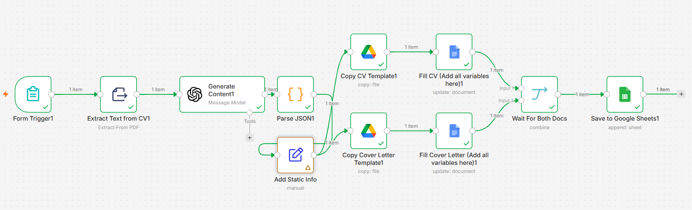

# Job Application Automation Agent



An n8n workflow that turns a baseline CV and a job description into a targeted CV, a tailored cover letter, and a searchable Google Sheets record of the application.

The workflow is designed around a simple principle: the AI adapts the presentation of existing experience to one role, while Google Docs remains the source of truth for layout and formatting. It does not invent experience or generate a document from scratch.

## What It Does

1. Collects a company name, job description, and baseline CV through an n8n form.
2. Extracts text from the uploaded PDF.
3. Sends the job description and CV text to an OpenAI-compatible chat model.
4. Parses the model response into a strict JSON object.
5. Copies a CV template and a cover-letter template in Google Drive.
6. Replaces the templates' placeholders with the generated content.
7. Waits for both documents to finish updating.
8. Appends the company name and document links to Google Sheets.

## Repository Structure

```text
.
├── CV_Coverletter_Optimiser.json       # Importable n8n workflow
├── README.md                           # Setup and usage guide
├── ressources/
│   └── Workflow.png                     # Workflow architecture image
└── Templates/
	├── Cv_Bellmir_Yahya_AI_DataScience_Universall.docx
	└── Universal_Cover_Letter_Template.docx.docx
```

## Requirements

- An n8n instance with permission to import and run workflows.
- An OpenAI-compatible model credential. The exported workflow currently references the NVIDIA Nemotron model `nvidia/nemotron-3-super-120b-a12b`; configure the provider and model that you intend to use.
- Google Drive, Google Docs, and Google Sheets OAuth credentials connected in n8n.
- A Google Sheet with columns named `Company`, `CV Link`, and `Cover Letter Link`.
- A baseline CV available as a readable PDF.

## Quick Start

### 1. Import the workflow

1. Open n8n.
2. Select **Import from File**.
3. Choose [`CV_Coverletter_Optimiser.json`](CV_Coverletter_Optimiser.json).
4. Open every Google and model node and select credentials that belong to your n8n instance.

The exported workflow contains credential references from the original environment. Those references are not portable credentials, so they must be replaced after import.

### 2. Prepare the Google templates

The files in `Templates/` are starting points. Upload each one to Google Drive and open it with Google Docs, then make sure it is converted to a **native Google Docs document**. The Google Docs node edits native Google Docs files; it should not be given a raw `.docx` file ID.

Copy the resulting Google Docs URLs into these nodes:

- **Copy CV Template1**: the master CV document ID
- **Copy Cover Letter Template1**: the master cover-letter document ID

Keep the desired font, spacing, bolding, and bullet formatting on the placeholder text itself. Replaced text inherits the formatting of the placeholder in the template.

### 3. Configure personal information

Open **Add Static Info** and replace the example values for:

- `MY_NAME`
- `MY_ADDRESS`
- `MY_PHONE`
- `MY_EMAIL`

This information is used by the cover-letter branch. Avoid committing personal data or credentials to a public repository.

### 4. Configure Google Sheets

Open **Save to Google Sheets1** and select the destination spreadsheet and worksheet. The node appends one row containing:

| Column | Value |
| --- | --- |
| `Company` | Company submitted in the form |
| `CV Link` | Generated Google Docs CV |
| `Cover Letter Link` | Generated Google Docs cover letter |

The destination worksheet should expose these exact column names to n8n.

### 5. Activate the form

Open **Form Trigger1**, review the form URL and fields, then activate the workflow. The form asks for:

| Field | Required | Notes |
| --- | --- | --- |
| Company Name | Yes | Target employer name |
| Job Description | Yes | Full job posting text is best |
| Upload Baseline CV | Yes | PDF used as the factual source |

Submit a real test application while the workflow is in test mode first. Confirm that both documents are created and that their links appear in the spreadsheet before sharing the production form URL.

## Template Placeholders

### CV placeholders

The CV branch currently replaces:

```text
{{TARGET_JOB_TITLE}}  {{TAILORED_SUMMARY}}
{{VINCI_B1}}          {{VINCI_B2}}          {{VINCI_B3}}          {{VINCI_B4}}
{{DECLIC_B1}}         {{DECLIC_B2}}         {{DECLIC_B3}}
{{RADEM_B1}}          {{RADEM_B2}}
{{PROJET_TEST_B1}}    {{PROJET_TEST_B2}}
{{PROJET_PLAGIAT_B1}} {{PROJET_PLAGIAT_B2}}
{{PROJET_MULTI_B1}}   {{PROJET_MULTI_B2}}
```

### Cover-letter placeholders

The cover-letter branch replaces:

```text
{{MY_NAME}}       {{MY_ADDRESS}}    {{MY_PHONE}}      {{MY_EMAIL}}
{{COMPANY}}       {{CITY}}          {{DATE}}
{{SUBJECT}}       {{GREETING}}
{{PARAGRAPH_1}}   {{PARAGRAPH_2}}   {{PARAGRAPH_3}}
{{PARAGRAPH_4}}   {{PARAGRAPH_5}}   {{CLOSING}}
```

Placeholders must match exactly, including capitalization, braces, and underscores. A missing or misspelled placeholder will remain unreplaced in the output document.

## AI Output Contract

The **Generate Content1** node instructs the model to return one flat JSON object with no Markdown or extra commentary. Every value must be a string. The prompt also requires that:

- CV bullets remain factual and are rewritten rather than copied verbatim.
- Each CV bullet is limited to 115 characters to preserve a one-page layout.
- The cover-letter subject follows `Candidature au poste de X chez Y`.
- The city defaults to Meknès and the date is written in French format.

The **Parse JSON1** node extracts the JSON object, parses it, and adds `COMPANY` from the form submission. Keep the prompt keys, template placeholders, and Google Docs replacement actions synchronized.

## Adding or Renaming a Variable

When adding a new generated field:

1. Add the exact key to the system prompt in **Generate Content1**.
2. Add the matching `{{PLACEHOLDER}}` to the appropriate Google Docs template.
3. Add a `replaceAll` action to the relevant Google Docs node.
4. Map the replacement to the parser output, for example:

   ```text
   ={{ $('Parse JSON1').item.json.NEW_FIELD }}
   ```

5. Test the workflow with a document containing the new placeholder.

For static values, add the field to **Add Static Info** and map it from `$('Add Static Info').item.json.FIELD_NAME` in the cover-letter node.

## Workflow Internals

| Stage | n8n node | Responsibility |
| --- | --- | --- |
| Intake | `Form Trigger1` | Receives the application inputs |
| Extraction | `Extract Text from CV1` | Converts the uploaded PDF into text |
| Generation | `Generate Content1` | Produces tailored CV and letter fields |
| Validation boundary | `Parse JSON1` | Parses the model response and adds the company |
| Personal data | `Add Static Info` | Supplies reusable contact information |
| Document creation | `Copy CV Template1`, `Copy Cover Letter Template1` | Creates job-specific copies |
| Document editing | `Fill CV...`, `Fill Cover Letter...` | Replaces placeholders in Google Docs |
| Synchronization | `Wait For Both Docs` | Combines both completed branches |
| Tracking | `Save to Google Sheets1` | Stores links for later retrieval |

The two document branches run in parallel. **Wait For Both Docs** is important: it prevents the spreadsheet row from being written until both generated documents have completed their updates.

## Troubleshooting

### Google Docs returns a 404

The template is probably still a `.docx` file or the selected Google account cannot access it. Convert the file to native Google Docs format and reselect its URL in the copy node.

### Placeholders remain in the output

Check the spelling and capitalization in the template, then confirm that the same key exists in the AI prompt and in the corresponding `replaceAll` action.

### JSON parsing fails

Inspect the output of **Generate Content1**. The response must contain one valid JSON object. Keep the instruction that forbids Markdown and commentary, and verify that the selected model is returning plain strings for every key.

### The workflow does not reach Google Sheets

Inspect both Google Docs branches. Confirm that both copy nodes and both update nodes succeed, then verify that **Wait For Both Docs** receives one item from each input.

### The output contains invented information

Treat the baseline CV as the factual source. Strengthen the prompt if necessary, review generated documents before sending them, and never rely on automation as a substitute for human verification.

- Use least-privilege OAuth accounts and restrict access to generated documents and the tracking sheet.
- Keep API credentials out of this repository and out of exported workflow files shared publicly.
- Review every generated CV and cover letter for accuracy, tone, and correct company details.

## Next steps

Add an email automated delivery system using zapier to fully automate the process using GmailAPI
